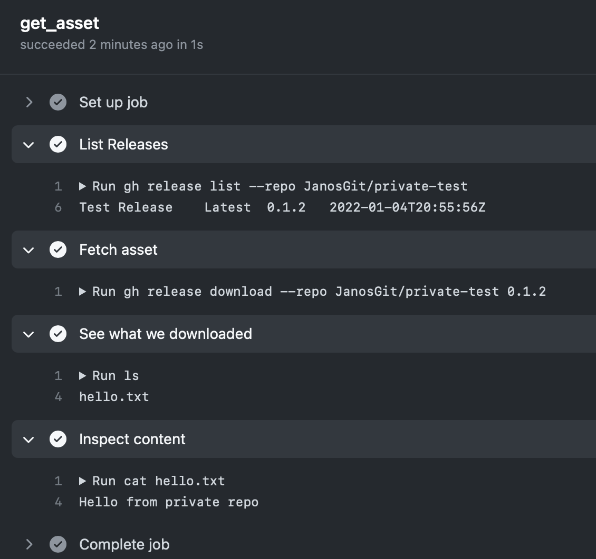

# Download a Release Asset
A test repository to figure out how to download a release asset from another private repository in a GitHub Actions workflow.

To do that, I used [GitHub CLI](https://docs.github.com/en/actions/advanced-guides/using-github-cli-in-workflows), especially the `gh release` command. Turns out it is really simple!

Just have a look at [the workflow](.github/). One note: To access another repository from an Actions workflow, the built in GitHub token `${{ secrets.GITHUB_TOKEN }}` that you'll find in some tutorials does not work. Instead you have to create a token especially for that purpose with matching access rights and store it as secret.